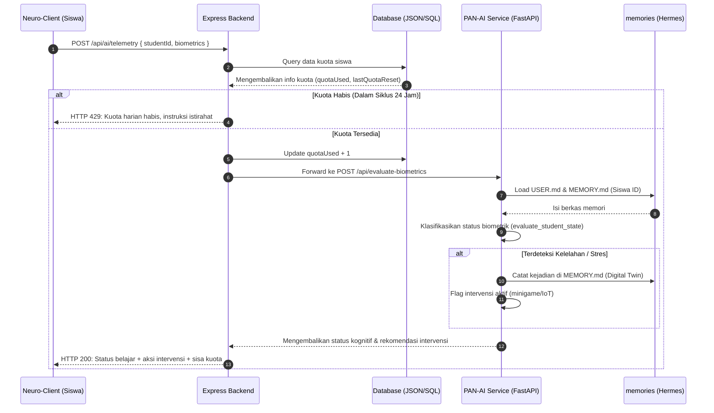

# PAN-AI Core Service (PANDAI AI Gate)

Sistem agen AI terpusat untuk proyek PANDAI yang mengintegrasikan runtime agen **OpenClaw** dan arsitektur memori **Hermes** untuk asisten pembuat soal, evaluasi biometrik kognitif murid, serta pengelolaan Digital Twin siswa. Layanan ini dilengkapi dengan pembatasan kuota berbasis permintaan (request-based quota) harian.

---

## 🏛️ Arsitektur Sistem

Sistem PAN-AI dirancang menggunakan arsitektur microservices yang didekopel (decoupled) untuk memastikan performa tinggi, efisiensi sumber daya server, dan independensi fungsionalitas.

```mermaid
graph TD
    subgraph Client Layer
        A[Neuro-Client-Siswa]
        B[LMS Web Guru]
    end

    subgraph Backend Layer
        C[PANDAI Express Backend]
        D[(Database: shared_users.json)]
    end

    subgraph AI Service Layer (PAN-AI)
        E[FastAPI API Gateway]
        F[Skills Engine]
        G[(Hermes Memories: USER.md / MEMORY.md)]
    end

    subgraph External AI Core
        H[Google Gemini API / Local Hermes LLM]
    end

    A -- Telemetri & Soal --> C
    B -- Buat Soal --> C
    C -- 1. Cek Kuota --> D
    C -- 2. Forward Request --> E
    E -- 3. Load Memori --> G
    E -- 4. Jalankan Logika --> F
    F -- 5. Query LLM jika perlu --> H
    E -- 6. Update Memori --> G
    E -- 7. Return Result --> C
    C -- 8. Return Result & Quota --> A
```

### Penjelasan Komponen:
1. **Client Layer**: Aplikasi desktop siswa (*Neuro-Client*) dan antarmuka web guru mengirimkan permintaan ke server backend utama. Data yang dikirim oleh siswa berupa ringkasan status biometrik terkompresi.
2. **Backend Layer**: Server Node.js/Express menangani autentikasi, otorisasi, dan manajemen kuota siswa sebelum meneruskan permintaan ke AI.
3. **AI Service Layer (FastAPI)**: Memproses data biometrik, memuat konteks ingatan Digital Twin siswa, dan menentukan keputusan intervensi (seperti pemicuan *minigame*).
4. **Hermes Memories**: Penyimpanan file profil kognitif individual siswa (`USER.md` dan `MEMORY.md`) untuk memberikan personalisasi belajar jangka panjang.
5. **External AI Core**: Mesin LLM (Gemini API untuk cloud / Ollama Hermes untuk lokal) yang bertindak sebagai otak logika tinggi ketika melakukan interpretasi kompleks atau pembuatan soal.

---

## 🔄 Alur Kerja Data (Data Flow)

### 1. Alur Telemetri Biometrik & Intervensi Kognitif



### 2. Alur Pembuatan Soal Otomatis (Quiz Generator)
1. **Guru** meminta pembuatan kuis baru melalui Dasbor LMS dengan mengirimkan parameter topik, kelas, dan tingkat kesulitan.
2. **Express Backend** memverifikasi hak akses guru, lalu meneruskan payload ke PAN-AI `/api/generate-quiz`.
3. **PAN-AI** memanggil Gemini API dengan parameter skema JSON terstruktur.
4. **Gemini API** mengembalikan data soal pilihan ganda (soal, pilihan jawaban, kunci, pembahasan) berformat JSON valid.
5. **PAN-AI** meneruskan data soal ke backend utama untuk disimpan ke dalam database kurikulum dan didistribusikan ke kelas.

---

## 📋 API Spec (Endpoints)

### 1. `POST /api/ai/telemetry` (Express Backend)
Endpoint yang dipanggil oleh aplikasi siswa untuk mengirimkan data biometrik.
- **Request Body**:
  ```json
  {
    "studentId": "siswa-01",
    "heartRate": 85.0,
    "hrv": 45.0,
    "ear": 0.24,
    "gsr": 3.2,
    "focusScore": 75.0
  }
  ```
- **Response**:
  ```json
  {
    "success": true,
    "student_id": "siswa-01",
    "cognitive_state": "NORMAL",
    "reason": "Kondisi belajar terpantau stabil dan optimal.",
    "intervention_recommended": false,
    "quotaRemaining": 49
  }
  ```

### 2. `POST /api/ai/generate-quiz` (Express Backend)
Endpoint yang dipanggil oleh dasbor guru untuk membuat soal ujian baru secara instan.
- **Request Body**:
  ```json
  {
    "studentId": "siswa-01",
    "topic": "Aljabar Linear",
    "grade": "12",
    "difficulty": "Sedang",
    "numQuestions": 3
  }
  ```
- **Response**:
  ```json
  {
    "questions": [
      {
        "question": "Manakah di bawah ini yang merupakan matriks identitas 2x2?",
        "options": [
          "A. [[1, 0], [0, 1]]",
          "B. [[0, 1], [1, 0]]",
          "C. [[1, 1], [1, 1]]",
          "D. [[0, 0], [0, 0]]"
        ],
        "answer": "A",
        "explanation": "Matriks identitas adalah matriks persegi yang semua elemen pada diagonal utamanya adalah 1 dan elemen lainnya adalah 0."
      }
    ],
    "quotaRemaining": 48
  }
  ```
